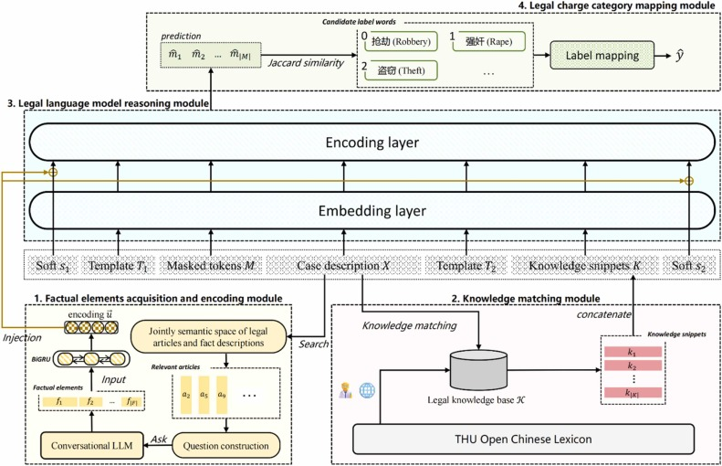








I am an Associate Professor and master's supervisor in the Computer Science and Technology major at [Northeast Forestry University](https://www.nefu.edu.cn/). The main research directions are: artificial intelligence, deep learning, natural language processing, large models, etc. Prior to this, I obtained a doctoral degree in Computer Science and Technology from [Harbin Engineering University](http://www.hrbeu.edu.cn/) in December 2023.

In recent years, I have been dedicated to applying technologies such as natural language processing, large language models, and neural networks to address practical issues in the fields of policy, law, and regulations, including text analysis, compliance detection, and question-answering systems. Welcome to click [here](https://ccec.nefu.edu.cn/info/1039/4807.htm) to visit my Chinese homepage as a teacher in the College of Computer and Control Engineering, Northeast Forestry University.

# 🔥 News

- *2025.08*: &nbsp;🎉🎉 I am honored to visit **The University of Auckland** in New Zealand for an exchange program.
- *2025.07*  &nbsp;🎉🎉 I am honored to participate in the AMEG international teaching training in **Melbourne**, Australia.
- *2024.03*: &nbsp;🎉🎉 I am honored to start my life as an Associate Professor at **Northeast Forestry University**!

# 🔍 Research Spotlight

COLING 2025

[A Compliance Checking Framework Based on Retrieval Augmented Generation](https://aclanthology.org/2025.coling-main.178/)

**Sun, Jingyun**, Zhongze Luo, Yang Li*

- We propose a compliance checking framework based on Retrieval-Augmented Generation (RAG). This framework includes a static layer for storing factual knowledge, a dynamic layer for storing regulatory and business process information, and a computational layer for retrieval and reasoning. We employ an eventic graph to structurally describe regulatory information as we recognize that the knowledge in regulatory documents is centered not on entities but on actions and states. We conducted experiments on Chinese and English compliance checking datasets.

ASC 2025

[A Multi-Source Heterogeneous Knowledge Injected Prompt Learning Method for Legal Charge Prediction](https://www.sciencedirect.com/science/article/abs/pii/S1568494625007495)

**Sun, Jingyun***, Chi Wei

- We propose a prompt learning framework-based method that simultaneously leverages multi-source heterogeneous external legal knowledge. Specifically, we match knowledge snippets in case descriptions via the legal knowledge base and encapsulate them into the input through a hard prompt template. Additionally, we retrieve legal articles related to the given case description through contrastive learning, and then obtain factual elements through a conversational Large Language Model (LLM). We fuse the embedding vectors of soft prompt tokens with the encoding vector of factual elements to achieve knowledge-enhanced model forward inference.

# 📝 Publications 

\* Corresponding author

## 2025

- **Sun, Jingyun**, Zhongze Luo, and Yang Li*. "A compliance checking framework based on retrieval augmented generation." Proceedings of the 31st International Conference on Computational Linguistics. 2025. [[link]](https://aclanthology.org/2025.coling-main.178) [CCF-B, Top Conference]

- Xin, Dancheng, Kaiqi Zhao, **Jingyun Sun**, and Yang Li*. "Cdaˆ2: Counterfactual diffusion augmentation for cross-domain adaptation in low-resource sentiment analysis." Proceedings of the 31st International Conference on Computational Linguistics. 2025. [[link]](https://aclanthology.org/2025.coling-main.6) [CCF-B, Top Conference]

- Lu, Yibing, **Jingyun Sun**, and Yang Li*. "Heterogeneous Graph Distillation for Stance Prediction." Expert Systems 42.6 (2025): e70058. [[link]](https://onlinelibrary.wiley.com/doi/abs/10.1111/exsy.70058) [CCF-C, JCR Q2]

- **Sun, Jingyun***, and Chi Wei. "A Multi-Source Heterogeneous Knowledge Injected Prompt Learning Method for Legal Charge Prediction." Applied Soft Computing (2025): 113438. [[link]](https://www.sciencedirect.com/science/article/abs/pii/S1568494625007495) [JCR Q1, IF=6.6]

## 2024

- **Sun, Jingyun***, Xinlong Chen, Kaiyuan Zheng, and Yan Zan. "A Fine-grained Classification Method for Cross-domain Policy Texts Based on Instruction Tuning." Information Systems Frontiers (2024): 1-16. [[link]](https://link.springer.com/article/10.1007/s10796-024-10554-2) [JCR Q1, IF=8.3]

- **Sun, Jingyun***, Shaobin Huang*, and Chi Wei*. "Chinese legal judgment prediction via knowledgeable prompt learning." Expert Systems with Applications 238 (2024): 122177. [[link]](https://www.sciencedirect.com/science/article/abs/pii/S0957417423026799) [CCF-C, JCR Q1]

- Huang, Shaobin, **Jingyun Sun**, and Rongsheng Li*. "NeuralConflict: Using neural networks to identify norm conflicts in normative documents." Expert Systems 41.6 (2024): e13035. [[link]](https://onlinelibrary.wiley.com/doi/abs/10.1111/exsy.13035) [CCF-C, JCR Q2]

## 2023

- **Sun, Jingyun***, Shaobin Huang, and Chi Wei. "A BERT-based deontic logic learner." Information Processing & Management 60.4 (2023): 103374. [[link]](https://www.sciencedirect.com/science/article/abs/pii/S0306457323001115) [CCF-B, JCR Q1]

- **Sun, Jingyun**, Shaobin Huang, and Rongsheng Li*. "An unsupervised policy relevance scoring method: Taking Chinese social security policies as the application case." Expert Systems 40.2 (2023): e13149. [[link]](https://onlinelibrary.wiley.com/doi/abs/10.1111/exsy.13149) [CCF-C, JCR-Q2]

# 📖 Educations
- *2018.09 - 2023.12*, Doctor of Computer Science and Technology, [Harbin Engineering University](http://www.hrbeu.edu.cn/), Harbin, China

# 💬 Projects and Fundings
In the past three years, the scientific research projects I have led or participated in include:

- Construction of Policy Audit Knowledge Graph and Development of Intelligent Audit Toolset (National Engineering Laboratory Project);
- Research on Compliance Detection Method Based on Text Semantics (Special Project for Basic Scientific Research Business of Central Universities);
- Tracking and Analysis of Science Funding Policies (Special Project of National Natural Science Foundation of China), etc.

# 📑 Services
- Invited reviewer for high-level journals and conferences such as *Expert Systems with Applications*, *Information Processing and Management* and *International Conference on Computational Linguistics (COLING)*.
- Academic committee member of  the CCF Youth Computer Science and Technology Forum.
- Invited expert of the Heilongjiang Province Service Trade Association.

