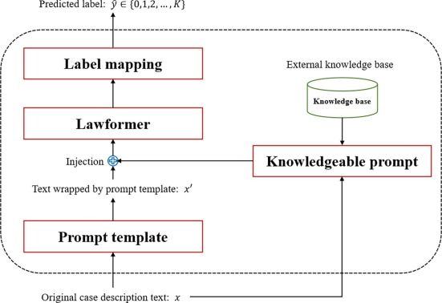








I am an associate professor and master's supervisor in the Computer Science and Technology major at [Northeast Forestry University](https://www.nefu.edu.cn/). The main research directions are: artificial intelligence, deep learning, natural language processing, large models, etc. Prior to this, I obtained a doctoral degree in Computer Science and Technology from [Harbin Engineering University](http://www.hrbeu.edu.cn/) in December 2023.

In recent years, I have been dedicated to applying technologies such as natural language processing, large language models, and neural networks to address practical issues in the fields of policy, law, and regulations, including text analysis, compliance detection, and question-answering systems.

Welcome to click [here](https://ccec.nefu.edu.cn/info/1039/4807.htm) to visit my Chinese homepage as a teacher in the College of Computer and Control Engineering, Northeast Forestry University.

# 🔥 News

- *2024.03*: &nbsp;🎉🎉 I am honored to start my life as an associate professor at Northeast Forestry University !!

# 🔍 Research Spotlight

COLING 2025

[A Compliance Checking Framework Based on Retrieval Augmented Generation](https://aclanthology.org/2025.coling-main.178/)

**Jingyun Sun**, Zhongze Luo, Yang Li*

- We propose a compliance checking framework based on Retrieval-Augmented Generation (RAG). This framework includes a static layer for storing factual knowledge, a dynamic layer for storing regulatory and business process information, and a computational layer for retrieval and reasoning. We employ an eventic graph to structurally describe regulatory information as we recognize that the knowledge in regulatory documents is centered not on entities but on actions and states. We conducted experiments on Chinese and English compliance checking datasets. The results demonstrate that our framework consistently achieves state-of-the-art results across various scenarios, surpassing other baselines.

ESWA 2024

[Chinese legal judgment prediction via knowledgeable prompt learning](https://www.sciencedirect.com/science/article/abs/pii/S0957417423026799)

**Sun, Jingyun***, Shaobin Huang*, and Chi Wei*

- The method aligns the Chinese LJP task with the pre-training task of a Pre-trained Language Model (PLM) via a prompt template to stimulate the PLM’s recall of learned knowledge. In addition, the well-designed prompt template can enhance the PLM’s understanding of the Chinese LJP task. We also use an external knowledge base to extract keyword information from the Chinese case description texts and incorporate it into the prompt template, thus enhancing the guidance of the prompt template to the PLM. Experimental results on CAIL2018, a high-quality Chinese LJP competition dataset, show that KnowPrompt4LJP achieves far better results than the baselines in zero-shot, few-shot, and full-size training data scenarios. KnowPrompt4LJP can achieve a macro F1 value of 0.70 in the low-resource scenario, which is comparable to the baselines’ results in the data-rich scenario. In the scenario of using full-size training data, KnowPrompt4LJP can achieve a macro F1 value of 0.81.

# 📝 Publications 

\* Corresponding author

## 2025

- **Sun, Jingyun**, Zhongze Luo, and Yang Li*. "A compliance checking framework based on retrieval augmented generation." Proceedings of the 31st International Conference on Computational Linguistics. 2025. [[link]](https://aclanthology.org/2025.coling-main.178)

- Xin, Dancheng, Kaiqi Zhao, **Jingyun Sun**, and Yang Li*. "Cdaˆ2: Counterfactual diffusion augmentation for cross-domain adaptation in low-resource sentiment analysis." Proceedings of the 31st International Conference on Computational Linguistics. 2025. [[link]](https://aclanthology.org/2025.coling-main.6)

- Lu, Yibing, **Jingyun Sun**, and Yang Li*. "Heterogeneous Graph Distillation for Stance Prediction." Expert Systems 42.6 (2025): e70058. [[link]](https://onlinelibrary.wiley.com/doi/abs/10.1111/exsy.70058)

- **Sun, Jingyun***, and Chi Wei. "A Multi-Source Heterogeneous Knowledge Injected Prompt Learning Method for Legal Charge Prediction." Applied Soft Computing (2025): 113438. [[link]](https://www.sciencedirect.com/science/article/abs/pii/S1568494625007495)

## 2024

- **Sun, Jingyun***, Xinlong Chen, Kaiyuan Zheng, and Yan Zan. "A Fine-grained Classification Method for Cross-domain Policy Texts Based on Instruction Tuning." Information Systems Frontiers (2024): 1-16. [[link]](https://link.springer.com/article/10.1007/s10796-024-10554-2)

- **Sun, Jingyun***, Shaobin Huang*, and Chi Wei*. "Chinese legal judgment prediction via knowledgeable prompt learning." Expert Systems with Applications 238 (2024): 122177. [[link]](https://www.sciencedirect.com/science/article/abs/pii/S0957417423026799)

- Huang, Shaobin, **Jingyun Sun**, and Rongsheng Li*. "NeuralConflict: Using neural networks to identify norm conflicts in normative documents." Expert Systems 41.6 (2024): e13035. [[link]](https://onlinelibrary.wiley.com/doi/abs/10.1111/exsy.13035)

## 2023

- **Sun, Jingyun***, Shaobin Huang, and Chi Wei. "A BERT-based deontic logic learner." Information Processing & Management 60.4 (2023): 103374. [[link]](https://www.sciencedirect.com/science/article/abs/pii/S0306457323001115)

- **Sun, Jingyun**, Shaobin Huang, and Rongsheng Li*. "An unsupervised policy relevance scoring method: Taking Chinese social security policies as the application case." Expert Systems 40.2 (2023): e13149. [[link]](https://onlinelibrary.wiley.com/doi/abs/10.1111/exsy.13149)

# 📖 Educations
- *2018.09 - 2023.12*, Doctor of Computer Science and Technology, [Harbin Engineering University](http://www.hrbeu.edu.cn/), Harbin, China

# 💬 Projects and Fundings
In the past three years, the scientific research projects I have led or participated in include:

- Construction of Policy Audit Knowledge Graph and Development of Intelligent Audit Toolset (National Engineering Laboratory Project, 700,000 yuan)
- Research on Compliance Detection Method Based on Text Semantics (Special Project for Basic Scientific Research Business of Central Universities, 200,000 yuan)
- Tracking and Analysis of Funding Policies of Major Science Funding Institutions in 2025 (Special Project of National Natural Science Foundation of China, 300,000 yuan), etc.

# 📑 Services
- Expert Systems With Application
- Information Processing and Management
- 31st International Conference on Computational Linguistics (COLING 2025)
